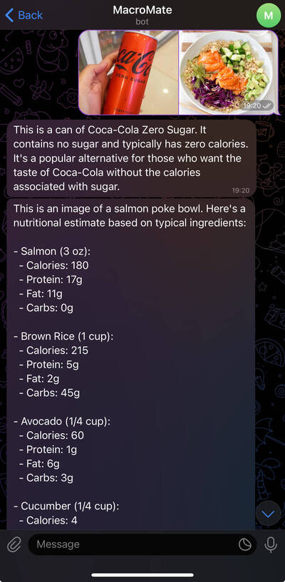

# Telegram Nutrition Tracker Bot

## Project Overview

This is a Telegram bot that helps users track their daily calorie and macronutrient intake using AI.  
The bot accepts both **text descriptions** and **food photos**, processes the input with **OpenAI API**, and returns estimated nutritional information.

The AI models are used for both **natural language understanding** (to parse text-based meal descriptions) and **image analysis** (to interpret food photos and estimate nutrition facts).

## Features

- Accepts both **text descriptions** and **images of meals** via Telegram.
- Uses **OpenAI API** to analyze and interpret user input.
- Calculates and returns:
  - Calories
  - Protein
  - Carbs
  - Fats
- Sends a **daily summary** of total intake.

## Example Screenshots

### Text Input Example

---

### Image Input Example

---

## Technologies Used

- Python  
- OpenAI API  
- Telegram Bot API  

## Disclaimer

This bot runs on private API keys and is not publicly deployed.  
The nutritional estimates are AI-generated and not guaranteed to be medically accurate.
